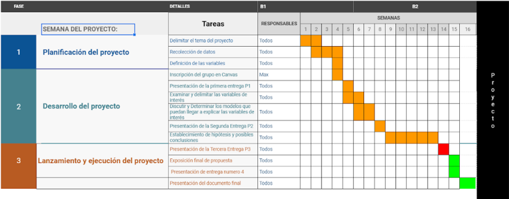

```{r setup, include=FALSE}
knitr::opts_chunk$set(echo = TRUE)
library(readr)
library(modeest)
library(dplyr)
library(ggplot2)
migracion_de_mexico <- read_csv("Base_de_datos/Encuesta_Nacional_de_Migracion.csv")
revisiones_migratorias <-read_csv("Base_de_datos/revisiones-migratorias.csv")
Percepcion_Seguridad_Publica_Datos <- read_delim("Base_de_datos/Percepcion Seguridad Publica - Datos.csv",
    ";", escape_double = FALSE, trim_ws = TRUE)
victimas_delito <- read.csv("Base_de_datos/personas-atendidas-victimas-delito.csv")
visitas_verificacion_migratoria <- read.csv("Base_de_datos/visitas-verificacion-migratoria.csv")
Indicadores <- read_delim("Base_de_datos/Indicadores.csv", 
    ";", escape_double = FALSE, trim_ws = TRUE)
incidencia_delictiva <- read_delim("Base_de_datos/Incidencia_Delictiva.csv", 
    ";", escape_double = FALSE, trim_ws = TRUE)
irregulares <- read_csv("Base_de_datos/Libro5.csv")
tasa_incidencia <- read_csv("Base_de_datos/Tasa-de-incidencia1.csv")
```

## **Introducción**

Este estudio trata un tema sensible el cual es sobre la inmigración y la violencia. En este caso, se esta dando el enfoque en México donde se conoce que tiene una alta tasa de violencia, sexismo y discriminación. Por lo que sería de interés saber si hay alguna relación entre estas dos variables.\
Con el paso de los años los países, en su mayoría países latinos, se han visto afectados por una gran cantidad de inmigrantes de diferentes partes del mundo por diversas razones. Este aumento progresivo de inmigraciones ha traído consigo beneficios y daños a la población donde se inmigra. Una de estos posibles daños es el aumento de crímenes/violencia tras la llegada de inmigrantes, sea por la misma población hacia los inmigrantes como los inmigrantes en sí. Por ello, es que nos enfocamos en México pues, tienen una cultura muy diversa y un alto flujo de inmigrantes. Por lo que se busca ver una relación entre estos dos factores, el incremento violencia y las inmigraciones.

## **Objetivo**

Evaluar el crecimiento de violencia según las inmigraciones realizadas en México por medio de datos extraídos del Instituto Nacional de Estadística y Geografía(INEGI).

-   **Objetivos Específicos**

    -   Determinar cómo las inmigraciones en México pueden alterar el orden público.
    -   Determinar que indicadores muestran una mayor relevancia.
    -   Hallar una correlación entre el aumento de violencia y las inmigraciones.\
    -   Conocer la percerpción de los mexicanos sobre los extranjeros en su país.
    -   Encontrar posibles relaciones que indiquen patronesde rechazo/intolerancia hacia los extranjeros en México.

-   **Preguntas Plateadas**

+-----------------------------------------------------------------------------------+------------------+
| Preguntas                                                                         | Tipo de pregunta |
+===================================================================================+==================+
| *¿Qué relación existe entre el índice de violencia y el de inmigraciones?*        | **Plausible**    |
+-----------------------------------------------------------------------------------+------------------+
| *¿En qué región se presenta mayor índice de violencia en el caso de inmigración?* | **Específica**   |
+-----------------------------------------------------------------------------------+------------------+
| *¿Se percibe inseguridad/incomodidad en presencia de un inmigrante?*              | **Factible**     |
+-----------------------------------------------------------------------------------+------------------+
| *¿Cuales son los motivos más frecuentes por los que se presenta discriminación?*  | **Plausible**    |
+-----------------------------------------------------------------------------------+------------------+
| *¿Afecta la presencia de extranjeros las oportunidades de trabajo?*               | **Interesante**  |
+-----------------------------------------------------------------------------------+------------------+
| *¿Cómo se percibe la presencia de un inmigrante?*                                 | **Interesante**  |
+-----------------------------------------------------------------------------------+------------------+

## **Marco Teórico**

-   **Población Objetivo**: Es el conjunto de individuos que conforman dos grupos, los inmigrantes y los ciudadanos mexicanos.

-   **Unidades Muestrales**: Inmigrantes y los ciudadanos mexicanos.

-   **Variables**: La variables encontradas se utilizarán para responder las preguntas planteadas.

+-------------------------------------------------------------------------------------------------------------------------------------------------------------------------------------+--------------------+
| Variables                                                                                                                                                                           | Tipos de variables |
+=====================================================================================================================================================================================+====================+
| Para usted, ¿Se justifica o no se justifica expulsar de una comunidad a alguien que no es de la religión que tiene la mayoría?                                                      | **Categórica**     |
+-------------------------------------------------------------------------------------------------------------------------------------------------------------------------------------+--------------------+
| Para usted, ¿Se justifica o no se justifica devolver a un extranjero a su país por no tener papeles?                                                                                | **Categórica**     |
+-------------------------------------------------------------------------------------------------------------------------------------------------------------------------------------+--------------------+
| Para usted, ¿Se justifica o no se justifica discriminar a inmigrantes por practicar costumbres diferentes?                                                                          | **Categórica**     |
+-------------------------------------------------------------------------------------------------------------------------------------------------------------------------------------+--------------------+
| ¿Estaría dispuesto o no estaría dispuesto a permitir que en su casa vivieran personas de otra religión?                                                                             | **Categórica**     |
+-------------------------------------------------------------------------------------------------------------------------------------------------------------------------------------+--------------------+
| ¿Podría decirme, por favor, una palabra que asocie con la expresión 'frontera norte de México'?                                                                                     | **Categórica**     |
+-------------------------------------------------------------------------------------------------------------------------------------------------------------------------------------+--------------------+
| ¿Podría decirme, por favor, una palabra que asocie con la expresión 'frontera sur de México'?                                                                                       | **Categórica**     |
+-------------------------------------------------------------------------------------------------------------------------------------------------------------------------------------+--------------------+
| Usted cree que los mexicanos que viven en el extranjero deben tener...                                                                                                              | **Categórica**     |
+-------------------------------------------------------------------------------------------------------------------------------------------------------------------------------------+--------------------+
| Usted considera que desde la crisis económica de 2008 han regresado...                                                                                                              | **Categórica**     |
+-------------------------------------------------------------------------------------------------------------------------------------------------------------------------------------+--------------------+
| ¿Cuál cree usted que es el principal problema de los mexicanos que regresan al país después de vivir en el extranjero?                                                              | **Categórica**     |
+-------------------------------------------------------------------------------------------------------------------------------------------------------------------------------------+--------------------+
| Actualmente, ¿cuál considera que es el principal problema para los extranjeros que viven en México?                                                                                 | **Categórica**     |
+-------------------------------------------------------------------------------------------------------------------------------------------------------------------------------------+--------------------+
| En general, ¿su opinión sobre los extranjeros que viven en México es muy buena, buena, mala o muy mala?                                                                             | **Categórica**     |
+-------------------------------------------------------------------------------------------------------------------------------------------------------------------------------------+--------------------+
| Dígame por favor ¿Qué tan de acuerdo o en desacuerdo está con las siguientes afirmaciones sobre los extranjeros que viven en México? Contribuyen a la economía de México            | **Categórica**     |
+-------------------------------------------------------------------------------------------------------------------------------------------------------------------------------------+--------------------+
| Dígame por favor ¿Qué tan de acuerdo o en desacuerdo está con las siguientes afirmaciones sobre los extranjeros que viven en México? Quitan empleos a los Mexicanos                 | **Categórica**     |
+-------------------------------------------------------------------------------------------------------------------------------------------------------------------------------------+--------------------+
| Dígame por favor ¿Qué tan de acuerdo o en desacuerdo está con las siguientes afirmaciones sobre los extranjeros que viven en México? Generan inseguridad                            | **Categórica**     |
+-------------------------------------------------------------------------------------------------------------------------------------------------------------------------------------+--------------------+
| Dígame por favor ¿Qué tan de acuerdo o en desacuerdo está con las siguientes afirmaciones sobre los extranjeros que viven en México? Traen ideas innovadoras                        | **Categórica**     |
+-------------------------------------------------------------------------------------------------------------------------------------------------------------------------------------+--------------------+
| Dígame por favor ¿Qué tan de acuerdo o en desacuerdo está con las siguientes afirmaciones sobre los extranjeros que viven en México? Debilitan nuestras costumbres y tradiciones    | **Categórica**     |
+-------------------------------------------------------------------------------------------------------------------------------------------------------------------------------------+--------------------+
| Dígame por favor ¿Qué tan de acuerdo o en desacuerdo está con las siguientes afirmaciones sobre los extranjeros que viven en México? Deberían pagar más impuestos que los mexicanos | **Categórica**     |
+-------------------------------------------------------------------------------------------------------------------------------------------------------------------------------------+--------------------+
| ¿En su día a día convive con extranjeros que viven México?                                                                                                                          | **Categórica**     |
+-------------------------------------------------------------------------------------------------------------------------------------------------------------------------------------+--------------------+
| Con respecto a la cantidad de extranjeros que viven en México, usted piensa que...                                                                                                  | **Categórica**     |
+-------------------------------------------------------------------------------------------------------------------------------------------------------------------------------------+--------------------+
| ¿Qué debería hacer el gobierno con los extranjeros que vienen a trabajar a México?                                                                                                  | **Categórica**     |
+-------------------------------------------------------------------------------------------------------------------------------------------------------------------------------------+--------------------+
| ¿Qué tanto se respetan los derechos de los extranjeros que viven en México?                                                                                                         | **Categórica**     |
+-------------------------------------------------------------------------------------------------------------------------------------------------------------------------------------+--------------------+
| Usted cree que los extranjeros que viven en México deben tener...                                                                                                                   | **Categórica**     |
+-------------------------------------------------------------------------------------------------------------------------------------------------------------------------------------+--------------------+
| ¿Qué tanto cree usted que se respetan en México los derechos de los extranjeros de Estados Unidos?                                                                                  | **Categórica**     |
+-------------------------------------------------------------------------------------------------------------------------------------------------------------------------------------+--------------------+
| ¿Qué tanto cree usted que se respetan en México los derechos de los extranjeros de Centroamérica?                                                                                   | **Categórica**     |
+-------------------------------------------------------------------------------------------------------------------------------------------------------------------------------------+--------------------+
| ¿Qué tanto cree usted que se respetan en México los derechos de los extranjeros de Europa?                                                                                          | **Categórica**     |
+-------------------------------------------------------------------------------------------------------------------------------------------------------------------------------------+--------------------+
| ¿Qué tanto cree usted que se respetan en México los derechos de los extranjeros de Asia?                                                                                            | **Categórica**     |
+-------------------------------------------------------------------------------------------------------------------------------------------------------------------------------------+--------------------+
| ¿Qué tanto cree usted que se respetan en México los derechos de los extranjeros de África?                                                                                          | **Categórica**     |
+-------------------------------------------------------------------------------------------------------------------------------------------------------------------------------------+--------------------+
| En comparación con los mexicanos, en general, para un extranjero que vive en México ¿es más fácil, igual o más difícil encontrar trabajo?                                           | **Categórica**     |
+-------------------------------------------------------------------------------------------------------------------------------------------------------------------------------------+--------------------+
| En general, ¿qué tanto considera que los mexicanos discriminan a los extranjeros que viven en el país?                                                                              | **Categórica**     |
+-------------------------------------------------------------------------------------------------------------------------------------------------------------------------------------+--------------------+
| ¿Usted cree que en México a los extranjeros se les trata igual a todos o depende del país donde provienen?                                                                          | **Categórica**     |
+-------------------------------------------------------------------------------------------------------------------------------------------------------------------------------------+--------------------+
| ¿Y a qué extranjeros vemos con buenos ojos?                                                                                                                                         | **Categórica**     |
+-------------------------------------------------------------------------------------------------------------------------------------------------------------------------------------+--------------------+
| ¿Con cuál de las siguientes frases está usted más de acuerdo?                                                                                                                       | **Categórica**     |
+-------------------------------------------------------------------------------------------------------------------------------------------------------------------------------------+--------------------+
| Dígame, ¿qué tan satisfecho o insatisfecho está con el desempeño del gobierno mexicano en materia de Política Exterior?                                                             | **Categórica**     |
+-------------------------------------------------------------------------------------------------------------------------------------------------------------------------------------+--------------------+
| Dígame, ¿qué tan satisfecho o insatisfecho está con el desempeño del gobierno mexicano en materia de Política Migratoria?                                                           | **Categórica**     |
+-------------------------------------------------------------------------------------------------------------------------------------------------------------------------------------+--------------------+
| Ante el clima de inseguridad y de violencia, usted considera que el gobierno federal tiene control sobre....                                                                        | **Categórica**     |
+-------------------------------------------------------------------------------------------------------------------------------------------------------------------------------------+--------------------+
| Y con respecto a los inmigrantes indocumentados que vienen a México ¿Usted considera que el gobierno mexicano debería o no debería permitir su entrada sin obstáculos?              | **Categórica**     |
+-------------------------------------------------------------------------------------------------------------------------------------------------------------------------------------+--------------------+
| Y con respecto a los inmigrantes indocumentados que vienen a México ¿Usted considera que el gobierno mexicano debería o no debería aumentar los controles fronterizos?              | **Categórica**     |
+-------------------------------------------------------------------------------------------------------------------------------------------------------------------------------------+--------------------+
| Y con respecto a los inmigrantes indocumentados que vienen a México ¿Usted considera que el gobierno mexicano debería o no debería deportarlos a su país de origen?                 | **Categórica**     |
+-------------------------------------------------------------------------------------------------------------------------------------------------------------------------------------+--------------------+
| Y con respecto a los inmigrantes indocumentados que vienen a México ¿Usted considera que el gobierno mexicano debería o no debería construir un muro en la frontera sur?            | **Categórica**     |
+-------------------------------------------------------------------------------------------------------------------------------------------------------------------------------------+--------------------+
| ¿Me podría decir en qué ESTADO y MUNICIPIO nació usted? ESTADO                                                                                                                      | **Categórica**     |
+-------------------------------------------------------------------------------------------------------------------------------------------------------------------------------------+--------------------+
| ¿Me podría decir en qué ESTADO y MUNICIPIO nació usted? MUNICIPIO                                                                                                                   | **Categórica**     |
+-------------------------------------------------------------------------------------------------------------------------------------------------------------------------------------+--------------------+
| ¿Tiene usted hijos? ¿Cuántos?                                                                                                                                                       | **Numérica**       |
+-------------------------------------------------------------------------------------------------------------------------------------------------------------------------------------+--------------------+
| ¿Habla usted algún otro idioma que no sea español?                                                                                                                                  | **Categórica**     |
+-------------------------------------------------------------------------------------------------------------------------------------------------------------------------------------+--------------------+
| Sexo                                                                                                                                                                                | **Categórica**     |
+-------------------------------------------------------------------------------------------------------------------------------------------------------------------------------------+--------------------+
| ¿Cuántos años cumplidos tiene usted?                                                                                                                                                | **Numérica**       |
+-------------------------------------------------------------------------------------------------------------------------------------------------------------------------------------+--------------------+
| ¿Cuál es el último nivel que estudió o cursó en la escuela?                                                                                                                         | **Categórica**     |
+-------------------------------------------------------------------------------------------------------------------------------------------------------------------------------------+--------------------+
| Edad                                                                                                                                                                                | **Numérica**       |
+-------------------------------------------------------------------------------------------------------------------------------------------------------------------------------------+--------------------+
| Condición de Actividad                                                                                                                                                              | **Categórica**     |
+-------------------------------------------------------------------------------------------------------------------------------------------------------------------------------------+--------------------+
| Estado Civil                                                                                                                                                                        | **Categórica**     |
+-------------------------------------------------------------------------------------------------------------------------------------------------------------------------------------+--------------------+
| Ingreso Individual                                                                                                                                                                  | **Categórico**     |
+-------------------------------------------------------------------------------------------------------------------------------------------------------------------------------------+--------------------+
| Ingreso Familiar                                                                                                                                                                    | **Categórico**     |
+-------------------------------------------------------------------------------------------------------------------------------------------------------------------------------------+--------------------+
| Región                                                                                                                                                                              | **Categórica**     |
+-------------------------------------------------------------------------------------------------------------------------------------------------------------------------------------+--------------------+
| Estrato                                                                                                                                                                             | **Categórica**     |
+-------------------------------------------------------------------------------------------------------------------------------------------------------------------------------------+--------------------+
| Tamaño de localidad                                                                                                                                                                 | **Categórica**     |
+-------------------------------------------------------------------------------------------------------------------------------------------------------------------------------------+--------------------+
| revisión de migraciones                                                                                                                                                             | **Numérica**       |
+-------------------------------------------------------------------------------------------------------------------------------------------------------------------------------------+--------------------+
| percepción de seguridad pública                                                                                                                                                     | **Numérica**       |
+-------------------------------------------------------------------------------------------------------------------------------------------------------------------------------------+--------------------+

### **Tabla de la encuesta nacional de migraciones en México**

La siguiente tabla contiene la mayoría de variables a utlizar en la investigación para determinar patrones.

```{r, echo=TRUE}
migracion_de_mexico_clean = migracion_de_mexico[,c(54:57,87:90,113,142,149:150,152:171,179:180,182:183,194:195,210:211,213:215,219:220,222:233,235,250,253:256,258:260)]
migracion_de_mexico_clean <- na.omit(migracion_de_mexico_clean)
migracion_de_mexico_clean
#http://www.losmexicanos.unam.mx/migracion/encuesta_nacional.html
```

### **Tabla de revisiones de migraciones**

```{r, echo=TRUE}
revisiones_migratorias_clean <- na.omit(revisiones_migratorias)
I_2015 <- data.frame(I_2015 = revisiones_migratorias_clean$`2015-01` + revisiones_migratorias_clean$`2015-02` + revisiones_migratorias_clean$`2015-03`)
II_2015 <- data.frame(II_2015 = revisiones_migratorias_clean$`2015-04` + revisiones_migratorias_clean$`2015-05` + revisiones_migratorias_clean$`2015-06`)
III_2015 <- data.frame(III_2015 = revisiones_migratorias_clean$`2015-07` + revisiones_migratorias_clean$`2015-08` + revisiones_migratorias_clean$`2015-09`)
IV_2015 <- data.frame(IV_2015 = revisiones_migratorias_clean$`2015-10` + revisiones_migratorias_clean$`2015-11` + revisiones_migratorias_clean$`2015-12`)


I_2016 <- data.frame(I_2016 = revisiones_migratorias_clean$`2016-01` + revisiones_migratorias_clean$`2016-02` + revisiones_migratorias_clean$`2016-03`)
II_2016 <- data.frame(II_2016 = revisiones_migratorias_clean$`2016-04` + revisiones_migratorias_clean$`2016-05` + revisiones_migratorias_clean$`2016-06`)
III_2016 <- data.frame(III_2016 = revisiones_migratorias_clean$`2016-07` + revisiones_migratorias_clean$`2016-8` + revisiones_migratorias_clean$`2016-09`)
IV_2016 <- data.frame(IV_2016 = revisiones_migratorias_clean$`2016-10` + revisiones_migratorias_clean$`2016-11` + revisiones_migratorias_clean$`2016-12`)


I_2017 <- data.frame(I_2017 = revisiones_migratorias_clean$`2017-01` + revisiones_migratorias_clean$`2017-02` + revisiones_migratorias_clean$`2017-03`)
II_2017 <- data.frame(II_2017 = revisiones_migratorias_clean$`2017-04` + revisiones_migratorias_clean$`2017-05` + revisiones_migratorias_clean$`2017-06`)
III_2017 <- data.frame(III_2017 = revisiones_migratorias_clean$`2017-07` + revisiones_migratorias_clean$`2017-08` + revisiones_migratorias_clean$`2017-9`)
IV_2017 <- data.frame(IV_2017 = revisiones_migratorias_clean$`2017-10` + revisiones_migratorias_clean$`2017-11` + revisiones_migratorias_clean$`2017-12`)

I_2018 <- data.frame(I_2018 = revisiones_migratorias_clean$`2018-01` + revisiones_migratorias_clean$`2018-02` + revisiones_migratorias_clean$`2018-03`)
II_2018 <- data.frame(II_2018 = revisiones_migratorias_clean$`2018-04` + revisiones_migratorias_clean$`2018-05` + revisiones_migratorias_clean$`2018-06`)
III_2018 <- data.frame(III_2018 = revisiones_migratorias_clean$`2018-07` + revisiones_migratorias_clean$`2018-08` + revisiones_migratorias_clean$`2018-09`)
IV_2018 <- data.frame(IV_2018 = revisiones_migratorias_clean$`2018-10` + revisiones_migratorias_clean$`2018-11` + revisiones_migratorias_clean$`2018-12`)

year_2015 <- data.frame(year_2015 = I_2015 + II_2015 + III_2015 + IV_2015)
year_2016 <- data.frame(year_2016 = I_2016 + II_2016 + III_2016 + IV_2016)
year_2017 <- data.frame(year_2017 = I_2017 + II_2017 + III_2017 + IV_2017)
year_2018 <- data.frame(year_2018 = I_2018 + II_2018 + III_2018 + IV_2018)

Nueva_tabla_2 <- data.frame(c(revisiones_migratorias[,2], year_2015, year_2016, year_2017, year_2018))

Nueva_tabla <- data.frame(c(revisiones_migratorias[,2], I_2015, II_2015, III_2015, IV_2015,  I_2016, II_2016, III_2016, IV_2016, I_2017, II_2017, III_2017, IV_2017, I_2018, II_2018, III_2018, IV_2018))
Nueva_tabla_2
```

### **Tabla de percepsión de seguridad pública**

```{r, echo=TRUE}
Percepcion_Seguridad_publica_clean <- na.omit(Percepcion_Seguridad_Publica_Datos)
a <- Percepcion_Seguridad_publica_clean[2:33,c(1,7:10)]
a
```

## **Tabla de Deportados por Irregularidades**

```{r}
irregul <- irregulares[c(2:33),]
irregul
```

## **Tabla de Tasa Delictiva**

```{r}
tasa_incidencia
```


## **Respondiendo las preguntas planteadas**

En esta gráfica se puede apreciar la cantidad de participantes de la encuesta nacional de migraciones en México distribuidas por nivel socio económico.

<center>

```{r, fig.align='center', echo=TRUE, fig.align='center'}
x <- migracion_de_mexico_clean$p42[which(migracion_de_mexico_clean$p42=="2")]
y_1 <- migracion_de_mexico_clean$ing_ind[which(migracion_de_mexico_clean$ing_ind=="2")]
y_2 <- migracion_de_mexico_clean$ing_ind[which(migracion_de_mexico_clean$ing_ind=="3")]
y_3 <- migracion_de_mexico_clean$ing_ind[which(migracion_de_mexico_clean$ing_ind=="4")]
y_4 <- migracion_de_mexico_clean$ing_ind[which(migracion_de_mexico_clean$ing_ind=="5")]

plot(table(c(y_1,y_2,y_3,y_4)), ylim=c(0,300) ,lwd = 5, xlab = "Etiquetas", ylab = "Frecuencia", col = "blue", type = "b", lty = 3, cex = 2 )
abline(h=c(0,50,100,150,200,250,300), v = 2:5, lty = "dotted", col = "gray53")
```

**2**: Menos de \$$2,047.49$\
**3**: De \$$2,047.50$ a \$$4,095.00$\
**4**: De \$$4.095.01$ a \$$6,142.50$\
**5**: Más de \$$6,142.50$

</center>

-   **¿En qué región se cree que se presenta mayor índice de violencia en el caso de inmigación?**

Clasificando los datos por regiones siendo estas (Centro, D.F. y Estado de Mexico, Norte y Sur). De acuerdo con nuestros datos, los encuestados respondieron a la pregunta qué cosas extrañan menos de méxico, la opción que fue más elegida fue la de "inseguridad , violencia y crimen organizado" donde la región de Centro muestra un mayor rechazo a la violencia con un $34,69$%, seguido por el D.F. y Estado de México con un $28,57$% , el Norte con un $18,37$% y por último el Sur con $17,69$%. Estos porcentajes presentan un error del $0,7$%

-   **¿Y cuáles serían las tres cosas que extrañaría MENOS de México?**

<center>

```{r, echo=TRUE, fig.align='center'}
par(mfrow = c(2,2))
z_1 <- migracion_de_mexico_clean$p20_1a_1[which(migracion_de_mexico_clean$Region=="1")]
z_2 <- migracion_de_mexico_clean$p20_1a_1[which(migracion_de_mexico_clean$Region=="2")]
z_3 <- migracion_de_mexico_clean$p20_1a_1[which(migracion_de_mexico_clean$Region=="3")]
z_4 <- migracion_de_mexico_clean$p20_1a_1[which(migracion_de_mexico_clean$Region=="4")]
plot(table(z_1), xlim = c(1,7), ylim=c(0,150), main="Centro", xlab = "Etiquetas", ylab = "Frecuencia", lwd = 3, col = "blueviolet",yaxp=c(0,150,5), type="b", lty=3, cex=1, pch=20)
abline(h=c(0,30,60,90,120,150), v = 1:7, lty = "dotted", col = "gray53")

plot(table(z_2), xlim = c(1,7), ylim=c(0,100), main="D.F. y Estado de México", xlab = "Etiquetas", ylab = "Frecuencia", lwd = 3, col = "blueviolet",yaxp=c(0,100,5), type="b", lty=3, cex=1, pch=20)
abline(h=c(0,20,40,60,80,100), v = 1:7, lty = "dotted", col = "gray53")

plot(table(z_3), xlim = c(1,7), ylim=c(0,80), main="Norte", xlab = "Etiquetas", ylab = "Frecuencia", lwd = 3, col = "blueviolet",yaxp=c(0,80,4), type="b", lty=3, cex=1, pch=20)
abline(h=c(0,20,40,60,80), v = 1:7, lty = "dotted", col = "gray53")

plot(table(z_4), xlim = c(1,7), ylim=c(0,60), main="Sur", xlab = "Etiquetas", ylab = "Frecuencia", lwd = 3, col = "blueviolet",yaxp=c(0,50,5), type="b", lty=3, cex=1, pch=20)
abline(h=c(0,10,20,30,40,50), v = 1:7, lty = "dotted", col = "gray53")
```

$1$: Pobreza, desigualdad, desempleo\
$2$: Inseguridad, violencia y crimen organizado\
$3$: Mal gobierno, corrupción, impunidad\
$4$: Lugar donde vive, espacio físico\
$5$: Cultura mexicana (música, tradiciones, idioma)\
$6$: Personas cercanas (familia,amigos,etc.)\
$7$: Baja calidad de vida

</center>

-   **¿Se percibe inseguridad/incomodidad en presencia de un inmigrante?**

Los encuestados al responder la pregunta "p43_3" que hace referencia a una afirmación que se les planteó "Los extranjeros en México genera inseguridad", ninguno de ellos indicó que se encontraba de acuerdo, pero 158 se encontraron "de acuerdo en parte" y 272 "ni de acuerdo ni en desacuerdo" y por último 521 no se encontraron de acuerdo con la afirmación. El resto de ellos 248 encuestados se abstuvieron.

-   **¿Qué tan de acuerdo o en desacuerdo está con las siguientes afirmaciones sobre los extranjeros que viven en México? Generan inseguridad**

<center>

```{r, echo=TRUE, fig.align='center'}
par(mfrow = c(2,2))
z_1 <- migracion_de_mexico_clean$p43_3[which(migracion_de_mexico_clean$Region=="1")]
z_2 <- migracion_de_mexico_clean$p43_3[which(migracion_de_mexico_clean$Region=="2")]
z_3 <- migracion_de_mexico_clean$p43_3[which(migracion_de_mexico_clean$Region=="3")]
z_4 <- migracion_de_mexico_clean$p43_3[which(migracion_de_mexico_clean$Region=="4")]
plot(table(z_1), xlim = c(1,5), ylim=c(20,120), main="Centro", xlab = "Etiquetas", ylab = "Frecuencia", lwd = 3, col = "blueviolet",yaxp=c(20,120,4), type="b", lty=3, cex=1, pch=20)
abline(h=c(20,45,70,95,120), v = 1:5, lty = "dotted", col = "gray53")

plot(table(z_2), xlim = c(1,5), ylim=c(20,120), main="D.F. y Estado de México", xlab = "Etiquetas", ylab = "Frecuencia", lwd = 3, col = "blueviolet",yaxp=c(20,120,4), type="b", lty=3, cex=1, pch=20)
abline(h=c(20,45,70,95,120), v = 1:5, lty = "dotted", col = "gray53")

plot(table(z_3), xlim = c(1,5), ylim=c(20,120), main="Norte", xlab = "Etiquetas", ylab = "Frecuencia", lwd = 3, col = "blueviolet",yaxp=c(20,120,4), type="b", lty=3, cex=1, pch=20)
abline(h=c(20,45,70,95,120), v = 1:5, lty = "dotted", col = "gray53")

plot(table(z_4), xlim = c(1,5), ylim=c(20,80), main="Sur", xlab = "Etiquetas", ylab = "Frecuencia", lwd = 3, col = "blueviolet",yaxp=c(20,80,4), type="b", lty=3, cex=1, pch=20)
abline(h=c(20,35,50,65,80), v = 1:5, lty = "dotted", col = "gray53")
```

$1$: Deacuerdo\
$2$: De acuerdo en parte\
$3$: Ni de acuerdo ni en desacuerdo\
$4$: En desacuerdo en parte\
$5$: En desacuerdo

</center>

#### **¿Afecta la presencia de extranjeros las oportunidades de trabajo?**

Utilizando la base de datos en la pregunta p43_2 que pregunta sobre qué tan de acuerdo se encuentran los encuestados con la afirmación de "los extranjeros que viven en México quitan empleo a los mexicanos". En las gráficas se aprecia que en la mayoría de regiones se está "de acuerdo en parte " con esta afirmación. Por lo que creemos que esto puede ser un factor que incremente la violencia por que se está quitando oportunidades de trabajo a los residentes

#### **¿Qué tan de acuerdo o en desacuerdo está con las siguientes afirmaciones sobre los extranjeros que viven en México? Quitan empleos a los Mexicanos**

<center>

```{r, echo=TRUE, fig.align='center'}
par(mfrow = c(2,2))
z_1 <- migracion_de_mexico_clean$p43_2[which(migracion_de_mexico_clean$Region=="1")]
z_2 <- migracion_de_mexico_clean$p43_2[which(migracion_de_mexico_clean$Region=="2")]
z_3 <- migracion_de_mexico_clean$p43_2[which(migracion_de_mexico_clean$Region=="3")]
z_4 <- migracion_de_mexico_clean$p43_2[which(migracion_de_mexico_clean$Region=="4")]

plot(table(z_1), xlim = c(1,5), ylim=c(0,100), main="Centro", xlab = "Etiquetas", ylab = "Frecuencia", lwd = 2, col = "blueviolet",yaxp=c(0,100,4), type="o", lty=1, cex=1.5, pch=20)
abline(h=c(0,25,50,75,100), v = 1:5, lty = "dotted", col = "gray53")
abline(h=mean(table(z_1)), col="darkblue", lwd = 2)

plot(table(z_2), xlim = c(1,5), ylim=c(0,100), main="D.F. y Estado de México", xlab = "Etiquetas", ylab = "Frecuencia", lwd = 2, col = "deepskyblue3",yaxp=c(0,100,4), type="o", lty=1, cex=1.5, pch=20)
abline(h=c(0,25,50,75,100), v = 1:5, lty = "dotted", col = "gray53")
abline(h=mean(table(z_2)), col="darkblue", lwd = 2)

plot(table(z_3), xlim = c(1,5), ylim=c(0,120), main="Norte", xlab = "Etiquetas", ylab = "Frecuencia", lwd = 2, col = "indianred4",yaxp=c(0,120,4), type="o", lty=1, cex=1.5, pch=20)
abline(h=c(0,30,60,90,120), v = 1:5, lty = "dotted", col = "gray53")
abline(h=mean(table(z_3)), col="darkblue", lwd = 2)

plot(table(z_4), xlim = c(1,5), ylim=c(0,90), main="Sur", xlab = "Etiquetas", ylab = "Frecuencia", lwd = 2, col = "seagreen4",yaxp=c(0,90,3), type="o", lty=1, cex=1.5, pch=20)
abline(h=c(0,30,60,90), v = 1:5, lty = "dotted", col = "gray53")
abline(h=mean(table(z_4)), col="darkblue", lwd = 2)
```

$1$: Deacuerdo\
$2$: De acuerdo en parte\
$3$: Ni de acuerdo ni en desacuerdo\
$4$: En desacuerdo en parte\
$5$: En desacuerdo

</center>

#### **¿Cómo se percibe la presencia de un inmigrante?**

Tomando en cuenta las preguntas respondidas anteriormente podemos decir la presencia de inmigrantes no representa inseguridad a la población mexicana pero sí puede resultar un poco preocupante cuando se relaciona al trabajo ya que sienten que los extranjeros pueden quitarles oportunidades laborales. Para ver un poco más sobre cómo se percibe la presencia de los inmigrantes usaremos las preguntas las preguntas 43_5 y 43\_-1 Las cuales indican el impacto de los extranjeros a las costumbres de la ciudadanía mexicana y si estos contribuyen a la economía del país. Es así, que en el caso de la afectación de las costumbres mexicanas por parte de los extranjeros, la población percibe que no debilitan las tradiciones locales y por ello, podemos inferir que nos los perciben como una amenaza desde un punto de vista cultural. De igual manera, en el caso de la utilidad de la población extranjera para el desarrollo económico, la población cree que sí son útiles para impulsar dicho desarrollo.\
Por ende, si lo analizamos desde un punto de vista literal, la percepción de los inmigrantes por parte de los mexicanos es relativamente positiva en cuanto al aspecto cultural; mientras que en el aspecto económico y social, existe una combinación. Pues si bien la mayoría de ciudadanos no sienten necesariamente inseguridad y/o incomodidad ante un extranjero; si creen que estos podrían afectarlos directamente en su economía debido a la ocupación de puestos de trabajo.

#### **¿su opinión sobre los extranjeros que viven en México es muy buena, buena, mala o muy mala?**

<center>

```{r, echo=TRUE, fig.align='center'}
par(mfrow = c(2,2))
z_1 <- migracion_de_mexico_clean$p42[which(migracion_de_mexico_clean$Region=="1")]
z_2 <- migracion_de_mexico_clean$p42[which(migracion_de_mexico_clean$Region=="2")]
z_3 <- migracion_de_mexico_clean$p42[which(migracion_de_mexico_clean$Region=="3")]
z_4 <- migracion_de_mexico_clean$p42[which(migracion_de_mexico_clean$Region=="4")]

plot(table(z_1), xlim = c(1,5), ylim=c(0,180), main="Centro", xlab = "Etiquetas", ylab = "Frecuencia", lwd = 3, col = "blueviolet",yaxp=c(0,180,3), type="b", lty=3, cex=1, pch=20)
abline(h=c(0,60,120,180), v = 1:5, lty = "dotted", col = "gray53")
abline(h=mean(table(z_1)), col="darkblue", lwd = 2)
abline(h=(max(table(z_1)-min(table(z_1))))/2, col="gold4", lwd = 2)


plot(table(z_2), xlim = c(1,5), ylim=c(0,180), main="D.F. y Estado de México", xlab = "Etiquetas", ylab = "Frecuencia", lwd = 3, col = "deepskyblue3",yaxp=c(0,180,3), type="b", lty=3, cex=1, pch=20)
abline(h=c(0,60,120,180), v = 1:5, lty = "dotted", col = "gray53")
abline(h=mean(table(z_2)), col="darkblue", lwd = 2)
abline(h=(max(table(z_2)-min(table(z_2))))/2, col="gold4", lwd = 2)

plot(table(z_3), xlim = c(1,5), ylim=c(0,180), main="$Norte", xlab = "Etiquetas", ylab = "Frecuencia", lwd = 3, col = "indianred4",yaxp=c(0,180,3), type="b", lty=3, cex=1, pch=20)
abline(h=c(0,60,120,180), v = 1:5, lty = "dotted", col = "gray53")
abline(h=mean(table(z_3)), col="darkblue", lwd = 2)
abline(h=(max(table(z_3)-min(table(z_3))))/2, col="gold4", lwd = 2)

plot(table(z_4), xlim = c(1,5), ylim=c(0,150), main="Sur", xlab = "Etiquetas", ylab = "Frecuencia", lwd = 3, col = "seagreen4",yaxp=c(0,150,3), type="b", lty=3, cex=1, pch=20)
abline(h=c(0,50,100,150), v = 1:5, lty = "dotted", col = "gray53")
abline(h=mean(table(z_4)), col="darkblue", lwd = 2)
abline(h=(max(table(z_4)-min(table(z_4))))/2, col="gold4", lwd = 2)
```

$1$: Muy buena\
$2$: Buena\
$3$: Ni buena ni mala\
$4$: Mala\
$5$: Muy mala

</center>

#### **¿Qué tan de acuerdo o en desacuerdo está con las siguientes afirmaciones sobre los extranjeros que viven en México? Contribuyen a la economía de México**

<center>

```{r, echo=TRUE, fig.align='center'}
par(mfrow = c(2,2))
z_1 <- migracion_de_mexico_clean$p43_1[which(migracion_de_mexico_clean$Region=="1")]
z_2 <- migracion_de_mexico_clean$p43_1[which(migracion_de_mexico_clean$Region=="2")]
z_3 <- migracion_de_mexico_clean$p43_1[which(migracion_de_mexico_clean$Region=="3")]
z_4 <- migracion_de_mexico_clean$p43_1[which(migracion_de_mexico_clean$Region=="4")]

plot(table(z_1), xlim = c(1,5), ylim=c(0,180), main="Centro", xlab = "Etiquetas", ylab = "Frecuencia", lwd = 2, col = "blueviolet",yaxp=c(0,180,3), type="o", lty=1, cex=1.5, pch=20)
abline(h=c(0,60,120,180), v = 1:5, lty = "dotted", col = "gray53")
abline(h=mean(table(z_1)), col="darkblue", lwd = 2)

plot(table(z_2), xlim = c(1,5), ylim=c(0,180), main="D.F. y Estado de México", xlab = "Etiquetas", ylab = "Frecuencia", lwd = 2, col = "deepskyblue3",yaxp=c(0,180,3), type="o", lty=1, cex=1.5, pch=20)
abline(h=c(0,60,120,180), v = 1:5, lty = "dotted", col = "gray53")
abline(h=mean(table(z_2)), col="darkblue", lwd = 2)

plot(table(z_3), xlim = c(1,5), ylim=c(0,150), main="Norte", xlab = "Etiquetas", ylab = "Frecuencia", lwd = 2, col = "indianred4",yaxp=c(0,150,3), type="o", lty=1, cex=1.5, pch=20)
abline(h=c(0,50,100,150), v = 1:5, lty = "dotted", col = "gray53")
abline(h=mean(table(z_3)), col="darkblue", lwd = 2)

plot(table(z_4), xlim = c(1,5), ylim=c(0,150), main="Sur", xlab = "Etiquetas", ylab = "Frecuencia", lwd = 2, col = "seagreen4",yaxp=c(0,150,3), type="o", lty=1, cex=1.5, pch=20)
abline(h=c(0,50,100,150), v = 1:5, lty = "dotted", col = "gray53")
abline(h=mean(table(z_4)), col="darkblue", lwd = 2)
```

$1$: Deacuerdo\
$2$: De acuerdo en parte\
$3$: Ni de acuerdo ni en desacuerdo\
$4$: En desacuerdo en parte\
$5$: En desacuerdo

</center>

#### **¿Qué tan de acuerdo o en desacuerdo está con las siguientes afirmaciones sobre los extranjeros que viven en México? Quitan empleos a los Mexicanos**

<center>

```{r, echo=TRUE, fig.align='center'}
par(mfrow = c(2,2))
z_1 <- migracion_de_mexico_clean$p43_2[which(migracion_de_mexico_clean$Region=="1")]
z_2 <- migracion_de_mexico_clean$p43_2[which(migracion_de_mexico_clean$Region=="2")]
z_3 <- migracion_de_mexico_clean$p43_2[which(migracion_de_mexico_clean$Region=="3")]
z_4 <- migracion_de_mexico_clean$p43_2[which(migracion_de_mexico_clean$Region=="4")]

plot(table(z_1), xlim = c(1,5), ylim=c(0,100), main="Centro", xlab = "Etiquetas", ylab = "Frecuencia", lwd = 2, col = "blueviolet",yaxp=c(0,100,4), type="o", lty=1, cex=1.5, pch=20)
abline(h=c(0,25,50,75,100), v = 1:5, lty = "dotted", col = "gray53")
abline(h=mean(table(z_1)), col="darkblue", lwd = 2)

plot(table(z_2), xlim = c(1,5), ylim=c(0,100), main="D.F. y Estado de México", xlab = "Etiquetas", ylab = "Frecuencia", lwd = 2, col = "deepskyblue3",yaxp=c(0,100,4), type="o", lty=1, cex=1.5, pch=20)
abline(h=c(0,25,50,75,100), v = 1:5, lty = "dotted", col = "gray53")
abline(h=mean(table(z_2)), col="darkblue", lwd = 2)

plot(table(z_3), xlim = c(1,5), ylim=c(0,120), main="Norte", xlab = "Etiquetas", ylab = "Frecuencia", lwd = 2, col = "indianred4",yaxp=c(0,120,4), type="o", lty=1, cex=1.5, pch=20)
abline(h=c(0,30,60,90,120), v = 1:5, lty = "dotted", col = "gray53")
abline(h=mean(table(z_3)), col="darkblue", lwd = 2)

plot(table(z_4), xlim = c(1,5), ylim=c(0,90), main="Sur", xlab = "Etiquetas", ylab = "Frecuencia", lwd = 2, col = "seagreen4",yaxp=c(0,90,3), type="o", lty=1, cex=1.5, pch=20)
abline(h=c(0,30,60,90), v = 1:5, lty = "dotted", col = "gray53")
abline(h=mean(table(z_4)), col="darkblue", lwd = 2)
```

$1$: Deacuerdo\
$2$: De acuerdo en parte\
$3$: Ni de acuerdo ni en desacuerdo\
$4$: En desacuerdo en parte\
$5$: En desacuerdo

</center>

#### **¿Qué tan de acuerdo o en desacuerdo está con las siguientes afirmaciones sobre los extranjeros que viven en México? Generan inseguridad**

<center>

```{r, echo=TRUE, fig.align='center'}
par(mfrow = c(2,2))
z_1 <- migracion_de_mexico_clean$p43_3[which(migracion_de_mexico_clean$Region=="1")]
z_2 <- migracion_de_mexico_clean$p43_3[which(migracion_de_mexico_clean$Region=="2")]
z_3 <- migracion_de_mexico_clean$p43_3[which(migracion_de_mexico_clean$Region=="3")]
z_4 <- migracion_de_mexico_clean$p43_3[which(migracion_de_mexico_clean$Region=="4")]
plot(table(z_1), xlim = c(1,5), ylim=c(0,120), main="Centro", xlab = "Etiquetas", ylab = "Frecuencia", lwd = 3, col = "blueviolet",yaxp=c(0,120,3), type="b", lty=3, cex=1, pch=20)
abline(h=c(0,40,80,120), v = 1:5, lty = "dotted", col = "gray53")

plot(table(z_2), xlim = c(1,5), ylim=c(0,120), main="D.F. y Estado de México", xlab = "Etiquetas", ylab = "Frecuencia", lwd = 3, col = "blueviolet",yaxp=c(0,120,4), type="b", lty=3, cex=1, pch=20)
abline(h=c(0,30,60,90,120), v = 1:5, lty = "dotted", col = "gray53")

plot(table(z_3), xlim = c(1,5), ylim=c(0,120), main="Norte", xlab = "Etiquetas", ylab = "Frecuencia", lwd = 3, col = "blueviolet",yaxp=c(0,120,3), type="b", lty=3, cex=1, pch=20)
abline(h=c(0,40,80,120), v = 1:5, lty = "dotted", col = "gray53")

plot(table(z_4), xlim = c(1,5), ylim=c(0,80), main="Sur", xlab = "Etiquetas", ylab = "Frecuencia", lwd = 3, col = "blueviolet",yaxp=c(0,80,4), type="b", lty=3, cex=1, pch=20)
abline(h=c(0,20,40,60,80), v = 1:5, lty = "dotted", col = "gray53")
```

$1$: Deacuerdo\
$2$: De acuerdo en parte\
$3$: Ni de acuerdo ni en desacuerdo\
$4$: En desacuerdo en parte\
$5$: En desacuerdo

</center>

#### **¿Qué tan de acuerdo o en desacuerdo está con las siguientes afirmaciones sobre los extranjeros que viven en México? Debilitan nuestras costumbres y tradiciones**

<center>

```{r, echo=TRUE, fig.align='center'}
par(mfrow = c(2,2))
z_1 <- migracion_de_mexico_clean$p43_5[which(migracion_de_mexico_clean$Region=="1")]
z_2 <- migracion_de_mexico_clean$p43_5[which(migracion_de_mexico_clean$Region=="2")]
z_3 <- migracion_de_mexico_clean$p43_5[which(migracion_de_mexico_clean$Region=="3")]
z_4 <- migracion_de_mexico_clean$p43_5[which(migracion_de_mexico_clean$Region=="4")]

plot(table(z_1), xlim = c(1,5), ylim=c(0,150), main="Centro", xlab = "Etiquetas", ylab = "Frecuencia", lwd = 2, col = "blueviolet",yaxp=c(0,150,3), type="o", lty=1, cex=1.5, pch=20)
abline(h=c(0,50,100,150), v = 1:5, lty = "dotted", col = "gray53")
abline(h=mean(table(z_1)), col="darkblue", lwd = 2)

plot(table(z_2), xlim = c(1,5), ylim=c(0,120), main="D.F. y Estado de México", xlab = "Etiquetas", ylab = "Frecuencia", lwd = 2, col = "deepskyblue3",yaxp=c(0,120,3), type="o", lty=1, cex=1.5, pch=20)
abline(h=c(0,40,80,120), v = 1:5, lty = "dotted", col = "gray53")
abline(h=mean(table(z_2)), col="darkblue", lwd = 2)

plot(table(z_3), xlim = c(1,5), ylim=c(0,100), main="Norte", xlab = "Etiquetas", ylab = "Frecuencia", lwd = 2, col = "indianred4",yaxp=c(0,100,4), type="o", lty=1, cex=1.5, pch=20)
abline(h=c(0,25,50,75,100), v = 1:5, lty = "dotted", col = "gray53")
abline(h=mean(table(z_3)), col="darkblue", lwd = 2)

plot(table(z_4), xlim = c(1,5), ylim=c(0,100), main="Sur", xlab = "Etiquetas", ylab = "Frecuencia", lwd = 2, col = "seagreen4",yaxp=c(0,100,4), type="o", lty=1, cex=1.5, pch=20)
abline(h=c(0,25,50,75,100), v = 1:5, lty = "dotted", col = "gray53")
abline(h=mean(table(z_4)), col="darkblue", lwd = 2)
```

$1$: Deacuerdo\
$2$: De acuerdo en parte\
$3$: Ni de acuerdo ni en desacuerdo\
$4$: En desacuerdo en parte\
$5$: En desacuerdo

</center>

#### **¿Las personas con menor nivel socioeconómico son las que más rechazan a los inmigrantes?**

-   Como se aprecia a través de las preguntas que indican el ingreso familiar y la opinión de la ciudadanía mexicana, respecto a los extranjeros y cómo estos afectan los puestos de trabajo en su país. Contamos con dos resultados distintos, pues por un lado realizando la comparativa de la opinión de la ciudadanía respecto a los extranjeros, basándonos en su nivel socio-económico; se puede distinguir que en términos generales, a pesar de estar comparando estratos, todos los intervalos presentan una tendencia similar pues su opinión no es buena ni mala (literalmente). Por otro lado, si comparamos los mismos estratos socioeconómicos respecto a la pregunta que indica la afectación negativa de los puestos de trabajo hacia los mexicanos a causa de los extranjeros, contamos con resultados significativamente distintos. Ya que, la clase alta y baja opinan mayoritariamente que sí existe un efecto negativo para la ciudadanía mexicana a causa de los extranjeros hacia los puestos de trabajo , mientras que los otros estratos piensan que no.

-   Es así que tomando en consideración la economía como uno de los pilares fundamentales para el desarrollo y subsistencia de la estructura base de la sociedad (la familia), es lógico determinar que si algo afecta negativamente los puestos de trabajo para cierto grupo de mexicanos, estos se sentirán por lo menos descontentos/incómodos/disconformes respecto a la causante de dicha situación. Por ello, es que deducimos que existe una contradicción en parte, respecto a lo que expresan los encuestados respecto a los extranjeros con aquello que realmente piensan/creen de ellos, al menos en los estratos mencionados.

-   Es así, que si bien no podemos concluir de manera tajante que las personas con menor nivel socioeconómico presentan el mayor rechazo hacia los extranjeros. Si podemos inferir que la primera pregunta al ser tan directa y hasta cierto punto delicada, pues es una opinión hacia una minoría, hizo que las personas encuestadas moderen sus respuestas y así no expresen su verdadera opinión respecto a los extranjeros. Finalmente, a causa de esto no podemos descartar una relación entre el nivel socioeconómico y el rechazo de la población hacia los extranjeros; lo cual podría traducirse en intolerancia y está a su vez en actitudes o expresiones que invitan a vulnerar la libertad de otros, siendo esto último catalogado como violencia.

#### **¿Qué tan de acuerdo o en desacuerdo está con las siguientes afirmaciones sobre los extranjeros que viven en México? Quitan empleos a los Mexicanos**

<center>

```{r, echo=TRUE, fig.align='center'}
par(mfrow = c(2,2))
z_1 <- migracion_de_mexico_clean$p43_2[which(migracion_de_mexico_clean$ing_ind=="2")]
z_2 <- migracion_de_mexico_clean$p43_2[which(migracion_de_mexico_clean$ing_ind=="3")]
z_3 <- migracion_de_mexico_clean$p43_2[which(migracion_de_mexico_clean$ing_ind=="4")]
z_4 <- migracion_de_mexico_clean$p43_2[which(migracion_de_mexico_clean$ing_ind=="5")]

plot(table(z_1), xlim = c(1,5), ylim=c(40,60), main="Menos de $2,047.49", xlab = "Etiquetas", ylab = "Frecuencia", lwd = 2, col = "blueviolet",yaxp=c(40,60,4), type="o", lty=1, cex=1.5, pch=20)
abline(h=c(40,45,50,55,60), v = 1:5, lty = "dotted", col = "gray53")
abline(h=mean(table(z_1)), col="darkblue", lwd = 2)

plot(table(z_2), xlim = c(1,5), ylim=c(10,30), main="De $2,047.50 a $4,095.00", xlab = "Etiquetas", ylab = "Frecuencia", lwd = 2, col = "deepskyblue3",yaxp=c(10,30,4), type="o", lty=1, cex=1.5, pch=20)
abline(h=c(10,15,20,25,30), v = 1:5, lty = "dotted", col = "gray53")
abline(h=mean(table(z_2)), col="darkblue", lwd = 2)

plot(table(z_3), xlim = c(1,5), ylim=c(0,20), main="$4,095.01 a 6,142.50", xlab = "Etiquetas", ylab = "Frecuencia", lwd = 2, col = "indianred4",yaxp=c(0,20,4), type="o", lty=1, cex=1.5, pch=20)
abline(h=c(0,5,10,15,20), v = 1:5, lty = "dotted", col = "gray53")
abline(h=mean(table(z_3)), col="darkblue", lwd = 2)

plot(table(z_4), xlim = c(1,5), ylim=c(0,20), main="Más de $6,142.50", xlab = "Etiquetas", ylab = "Frecuencia", lwd = 2, col = "seagreen4",yaxp=c(0,20,4), type="o", lty=1, cex=1.5, pch=20)
abline(h=c(0,5,10,15,20), v = 1:5, lty = "dotted", col = "gray53")
abline(h=mean(table(z_4)), col="darkblue", lwd = 2)
```

$1$: Deacuerdo\
$2$: De acuerdo en parte\
$3$: Ni de acuerdo ni en desacuerdo\
$4$: En desacuerdo en parte\
$5$: En desacuerdo

</center>

#### **¿Qué tan de acuerdo o en desacuerdo está con las siguientes afirmaciones sobre los extranjeros que viven en México? Generan inseguridad**

<center>

```{r, echo=TRUE, fig.align='center'}
par(mfrow = c(2,2))
z_1 <- migracion_de_mexico_clean$p43_3[which(migracion_de_mexico_clean$ing_ind=="2")]
z_2 <- migracion_de_mexico_clean$p43_3[which(migracion_de_mexico_clean$ing_ind=="3")]
z_3 <- migracion_de_mexico_clean$p43_3[which(migracion_de_mexico_clean$ing_ind=="4")]
z_4 <- migracion_de_mexico_clean$p43_3[which(migracion_de_mexico_clean$ing_ind=="5")]
plot(table(z_1), xlim = c(1,5), ylim=c(10,80), main="Menos de $2,047.49", xlab = "Etiquetas", ylab = "Frecuencia", lwd = 3, col = "blueviolet",yaxp=c(10,80,7), type="b", lty=3, cex=1, pch=20)
abline(h=c(10,20,30,40,50,60,70,80), v = 1:5, lty = "dotted", col = "gray53")

plot(table(z_2), xlim = c(1,5), ylim=c(0,30), main="De $2,047.50 a $4,095.00", xlab = "Etiquetas", ylab = "Frecuencia", lwd = 3, col = "blueviolet",yaxp=c(0,30,5), type="b", lty=3, cex=1, pch=20)
abline(h=c(0,6,12,18,24,30), v = 1:5, lty = "dotted", col = "gray53")

plot(table(z_3), xlim = c(1,5), ylim=c(0,17), main="$4,095.01 a 6,142.50", xlab = "Etiquetas", ylab = "Frecuencia", lwd = 3, col = "blueviolet",yaxp=c(0,15,3), type="b", lty=3, cex=1, pch=20)
abline(h=c(0,5,10,15,20), v = 1:5, lty = "dotted", col = "gray53")

plot(table(z_4), xlim = c(1,5), ylim=c(0,20), main="Más de $6,142.50", xlab = "Etiquetas", ylab = "Frecuencia", lwd = 3, col = "blueviolet",yaxp=c(0,20,4), type="b", lty=3, cex=1, pch=20)
abline(h=c(0,5,10,15,20), v = 1:5, lty = "dotted", col = "gray53")
```

$1$: Deacuerdo\
$2$: De acuerdo en parte\
$3$: Ni de acuerdo ni en desacuerdo\
$4$: En desacuerdo en parte\
$5$: En desacuerdo

</center>

### **Gráficas de la Percepción de Seguridad vs Inmigraciones**

En la gráfica de percepción de seguridad vs inmigraciones hay una relación inversamente proporcional, ya que al aumentar el número de inmigraciones la percepción de seguridad disminuye. Sin embargo esto no lo podemos asegurar al 100% ya que consideramos que deberíamos tener más años.

#### **Migraciones**

<center>

```{r,echo=TRUE}
par(mfrow=c(1,4))
boxplot(Nueva_tabla_2$I_2015,main="2015", ylab="Nuemero de migraciones", col="red")
boxplot(Nueva_tabla_2$I_2016,main="2016", ylab="Numero de migraciones", col="green")
boxplot(Nueva_tabla_2$I_2017,main="2017", ylab="Numero de migraciones", col="blue")
boxplot(Nueva_tabla_2$I_2018,main="2018", ylab="Numero de miraciones", col="purple")
```

</center>

#### **Percepción de seguridad pública**

<center>

```{r,echo=TRUE}
par(mfrow=c(1,4))
boxplot(a$`2015`,main="2015", ylab="Porcentaje de percepción de seguridad pública", col="red")
boxplot(a$`2016`,main="2016", ylab="Porcentaje de percepción de seguridad pública", col="green")
boxplot(a$`2017`,main="2017", ylab="Porcentaje de percepción de seguridad pública", col="blue")
boxplot(a$`2018`,main="2018", ylab="Porcentaje de percepción de seguridad pública", col="purple")
```

</center>

#### **¿Qué relación existe entre el índice de violencia y el de inmigraciones?**

A partir de los datos expresados en las variables categóricas mostradas en las líneas de código $99$-$102$ o preguntas (p67_1 - p67_5) podemos encontrar un patrón de rechazo por quienes fueron encuestados hacia los inmigrantes. La primera pregunta trata el tema si los inmigrantes deberían ingresar al país sin obstáculos por lo que los encuestados en su mayoría responden "$3$" que viene a ser "no debería" al igual un gran porcentaje se muestra en duda respondiendo "$2$" que se interpreta como "depende", este valor no se encuentra tan lejano a los que indicaron "$1$" que significa que "deberían" tener una entrada sin obstáculos. La pregunta 67_3 hace referencia al aumento de seguridad en los controles fronterizos, donde los encuestados en su gran mayoría respondieron a aumentar la seguridad mientras que un pequeño grupo mencionó que no se debería. En la pregunta 67_4 y 67_5 se habla sobre si se deberían deportar a los inmigrantes indocumentados y en la última pregunta se habla sobre la construcción de un muro como frontera contra los inmigrantes respectivamente. Ambas preguntas parecen ser un poco drásticas por lo que las respuestas son más equilibradas, en especial la pregunta 67_4, mientras que en la última de este grupo se rechaza en su mayoría la construcción del muro. Por otra parte , en las preguntas p11a_1 y p12a_1 se pregunta una palabra que sea asociada con las palabras frontera norte de méxico y frontera sur de méxico respectivamente. Un total de $187$ respuestas donde se asocia a la frontera de méxico con "violencia, muerte y discriminacion". La gran parte de las respuestas son expresadas por la pregunta p11a_1 acerca de la frontera norte. En síntesis se encuentra una relación entre las migraciones con lo que se piensa que puede causar. Donde existe relación entre migrante y violencia en un grupo de personas. Además, como los encuestados muestran un rechazo moderado según los resultados en las preguntas (p67_1 - p67_5).

-   **p67_1: ¿Usted considera que el gobierno mexicano debería o no debería permitir su entrada sin obstáculos?**
-   **p67_3: ¿Usted considera que el gobierno mexicano debería o no debería aumentar los controles fronterizos?**
-   **p67_4: ¿Usted considera que el gobierno mexicano debería o no debería deportarlos a su país de origen?**
-   **p67_5: ¿Usted considera que el gobierno mexicano debería o no debería construir un muro en la frontera sur?**

<center>

```{r, echo=TRUE, fig.align='center'}
par(mfrow = c(1,4))
x_1 <- migracion_de_mexico_clean$p67_1[which(migracion_de_mexico_clean$p67_1=="1")]
x_2 <- migracion_de_mexico_clean$p67_1[which(migracion_de_mexico_clean$p67_1=="2")]
x_3 <- migracion_de_mexico_clean$p67_1[which(migracion_de_mexico_clean$p67_1=="3")]
hist(c(x_1,x_2,x_3), main="Pregunta P67_1", xlab = "Etiquetas", ylab = "Frecuencia", xaxp = c(1,3,2),xlim = c(0.8,3) ,ylim = c(0,700), col = "lightblue3")
x_1 <- migracion_de_mexico_clean$p67_3[which(migracion_de_mexico_clean$p67_3=="1")]
x_2 <- migracion_de_mexico_clean$p67_3[which(migracion_de_mexico_clean$p67_3=="2")]
x_3 <- migracion_de_mexico_clean$p67_3[which(migracion_de_mexico_clean$p67_3=="3")]
hist(c(x_1,x_2,x_3), main="Pregunta P67_3", xlab = "Etiquetas", ylab = "Frecuencia", xaxp = c(1,3,2),xlim = c(0.8,3) ,ylim = c(0,700), col = "lightblue3")
x_1 <- migracion_de_mexico_clean$p67_4[which(migracion_de_mexico_clean$p67_4=="1")]
x_2 <- migracion_de_mexico_clean$p67_4[which(migracion_de_mexico_clean$p67_4=="2")]
x_3 <- migracion_de_mexico_clean$p67_4[which(migracion_de_mexico_clean$p67_4=="3")]
hist(c(x_1,x_2,x_3), main="Pregunta P67_4", xlab = "Etiquetas", ylab = "Frecuencia", xaxp = c(1,3,2),xlim = c(0.8,3) ,ylim = c(0,700), col = "lightblue3")
x_1 <- migracion_de_mexico_clean$p67_5[which(migracion_de_mexico_clean$p67_5=="1")]
x_2 <- migracion_de_mexico_clean$p67_5[which(migracion_de_mexico_clean$p67_5=="2")]
x_3 <- migracion_de_mexico_clean$p67_5[which(migracion_de_mexico_clean$p67_5=="3")]
hist(c(x_1,x_2,x_3), main="Pregunta P67_5", xlab = "Etiquetas", ylab = "Frecuencia", xaxp = c(1,3,2),xlim = c(0.8,3) ,ylim = c(0,700), col = "lightblue3")
```

$1$: Debería\
$2$: Depende\
$3$: No debería

</center>

## **Análisis Descriptivo**

Para esta entrega, realizamos el análisis descriptivo con una información relevante para el proyecto. De esa información podemos sacar la percepción que tienen los mexicanos con respecto a la inseguridad. Hicimos una estimación por intervalos de proporciones para tomar en cuenta el porcentaje de nuestra muestra y estimar la proporción de las personas que están de acuerdo en que los inmigrantes generan inseguridad a los habitantes mexicanos. En todos los análisis definimos nuestro nivel de significancia al 10%, debido a que como nuestra base de datos se enfoca en encuesta sociopolíticas. Este valor es sumamente utilizado para este caso de análisis. Para la proporción puntual requerida usamos la pregunta P43_3 que nos daba la cantidad de personas que se sentían inseguras frente a la presencia de extranjeros. Contando aquellas que marcaron las opciones uno "de acuerdo" y dos "de acuerdo en parte". Y dividimos la cantidad de personas que respondieron la encuesta. Obtuvimos un intervalo de 0.34 y 0.32, con un error de 0.022.\
Ahora, hicimos las pruebas de hipótesis con respecto al intervalo de confianza que tenemos. Primero, realizamos una hipótesis con la siguiente afirmación "al menos 50% de la población se sienten inseguras frente a los extranjeros". Se realizó los cálculos respectivos para corroborar si es que esta hipótesis se rechaza o no se rechaza. Debido al valor obtenido se encuentra en la zona de rechazo por lo que se rechaza esta hipótesis. Del mismo modo, realizamos una segunda hipótesis para corroborar que la estimación por intervalos es justificable. Si cambiamos el valor a 30% no se rechaza esta hipótesis. El segundo análisis se hizo con respecto a la opinión de los encuestados mexicanos con el tema de si quitan empleo o no. De esa información podemos sacar la percepción que tienen los mexicanos con respecto al ámbito laboral. Para ello aplicamos el mismo procedimiento que en anterior análisis solo que en este caso usamos la pregunta p43_2 de la encuesta nacional de migración Hicimos las pruebas de hipótesis con respecto al intervalo de confianza que tenemos. Primero, realizamos una hipótesis de al menos 50% de la población creían que se sienten amenazados a perder sus puestos de trabajo. Se realizaron los cálculos respectivos para corroborar si es que esta hipótesis se rechaza o no se rechaza. Del mismo modo, realizamos una segunda hipótesis para corroborar que la estimación por intervalos si es justificable al 30%. Por lo que no se rechaza esa hipótesis.

### **Proporción de personas en México que piensan que generan inseguridad**

```{r, echo=TRUE}
a <- table(migracion_de_mexico_clean$p43_3)
b <- table(na.omit(migracion_de_mexico_clean$p43_3))
c <- b[1:2]
p = sum(c)/sum(a)
desviacion = sd(c)
n = sum(a)
alpha = 0.1
z = qnorm(1-alpha/2)
```

-   **Intervalo de confianza**

```{r, echo=TRUE}
a = p - qnorm(1-alpha/2)*sqrt((p*(1-p))/n);
b = p + qnorm(1-alpha/2)*sqrt((p*(1-p))/n);
b
a
```

-   **Error**

```{r, echo=TRUE}
E = z*sqrt((p*(1-p))/n)
E
```

## **Prueba de Hipótesis**

Hipotesis: Al menos el 50% de los mexicanos se sienten inseguros frente a los extranjeros

#### Hipótesis con 50%

```{r, echo=TRUE}
z = (p-0.5)/sqrt((0.5*(1-0.5))/n)
z
```

#### Hipótesis con 30%

```{r,echo=TRUE}
z = (p-0.3)/sqrt((0.3*(1-0.3))/n)
z
```

#### Valor Crítico

```{r, echo=TRUE}
qnorm(0.1)
```

#### Conclusión

-   Dado que cae en la región de rechazo, rechazamos la hipótesis.

## **Análisis Descriptivo**

### **La proporción de personas que creen que los extrajeros quitan trabajo**

```{r, echo=TRUE}
a <- table(migracion_de_mexico_clean$p43_2)
b <- table(na.omit(migracion_de_mexico_clean$p43_2))
c <- b[1:2]
p = sum(c)/sum(a)
desviacion = sd(c)
n = sum(a)
alpha = 0.1
```

-   **Intervalo de confianza**

```{r, echo=TRUE}
z = qnorm(1-alpha/2)
a = p - qnorm(1-alpha/2)*sqrt((p*(1-p))/n);
b = p + qnorm(1-alpha/2)*sqrt((p*(1-p))/n);
b
a
```

-   **Error**

```{r, echo=TRUE}
E = z*sqrt((p*(1-p))/n)
E
```

## **Prueba de Hipótesis**

Hipotesis: Al menos el 50% de los mexicanos sienten que los extranjeros quitan trabajos

#### Hipótesis con 50%

```{r, echo=TRUE}
z = (p-0.5)/sqrt((0.5*(1-0.5))/n)
z
```

#### Hipótesis con 30%

```{r,echo=TRUE}
z = (p-0.3)/sqrt((0.3*(1-0.3))/n)
z
```

#### Valor Crítico

```{r, echo=TRUE}
qnorm(0.1)
```

#### Conclusión

-   Dado que cae en la región de rechazo, rechazamos la hipótesis.

## **Patrones**

relacionamos alguna de las variables más importantes que creíamos y esta relación la hicimos con la ayuda de covarianza para ver si es que guardan relación directa, inversa o no presentan relación alguna. Realizamos 4 pruebas. La primera presenta una relación directa por el valor que nos arroja, y la tendencia que nos marca. De las 4 pruebas que se hicieron, el segundo análisis presenta el menor valor en covarianza y podemos afirmar que no hay mucha relación entre las dos variables.

<center>

####**Condiciones para la regrasión lineal**

```{r}
b<-lm(a$`2015`~Nueva_tabla_2$I_2015)
cor.test(Nueva_tabla_2$I_2015,a$`2015`, conf.level = 0.9)
summary(b)
```
```{r}
plot(Nueva_tabla_2$I_2015,a$`2015`, main="Migraciones en el 2015 vs Percepción de Seguridad 2015" , xlab ="Migraciones realizadas en el 2015", ylab="Percepción de seguridad del 2015", lwd=3,col="green" ,bg ="blue",pch=21,cex=2)
abline(b,col="red",lwd=2)
legend("topright", "mín. cuadrados", col="firebrick2" ,title="Leyenda",lwd = 2)
text(3880,34, labels= "correlación = 0.1405449",col="blue", cex=1.1)
```

```{r,echo=TRUE}
a <- Percepcion_Seguridad_publica_clean[2:33,c(1,7:10)]
f <- function(x,y){
  M <- matrix(c(sum(x^2) ,sum(x), sum(x) ,length(x)),2)
  b <- matrix(c(sum((x)*(y)),sum(y)),2)
  A <- solve(M,b)
  y = A[1,1]*x + A[2,1]
  return(y)
}
g <- function(x){
  y = abs(covarianza*x^0)
  return(y)
  }
covarianza = cov(Nueva_tabla_2$I_2015,a$`2015`)
correlación = cor(Nueva_tabla_2$I_2015,a$`2015`)
plot(Nueva_tabla_2$I_2015,a$`2015`, main="Migraciones en el 2015 vs Percepción de Seguridad 2015" , xlab ="Migraciones realizadas en el 2015", ylab="Percepción de seguridad del 2015", lwd=3,col="green" ,bg ="blue",pch=21,cex=2)
lines(Nueva_tabla_2$I_2015,f(Nueva_tabla_2$I_2015,a$`2015`), col="firebrick2" , lwd = 2)
legend(x="topright", "mín. cuadrados", fill="firebrick2", title="Leyenda")
text(7450,32, labels= "correlación = 0.1405449",col="blue", cex=1.1)
```


</center>

<center>

```{r,echo=TRUE}
covarianza = cov(Nueva_tabla_2$I_2016,a$`2016`)
correlación = cor(Nueva_tabla_2$I_2016,a$`2016`)
#correlación
plot(Nueva_tabla_2$I_2016,a$`2016`, main="Migraciones en el 2016 vs Percepción de Seguridad 2016" , xlab ="Migraciones realizadas en el 2016", ylab="Percepción de seguridad del 2016", lwd=3,col="green" ,bg ="blue",pch=21,cex=2)
lines(Nueva_tabla_2$I_2016,f(Nueva_tabla_2$I_2016,a$`2016`), col="firebrick2" , lwd = 2)
legend(x="topright", "mín. cuadrados", fill="firebrick2", title="Leyenda")
text(6000,28, labels= "correlación = -0.08431051",col="blue", cex=1.1)
```

</center>

<center>

```{r}
b<-lm(a$`2017`~Nueva_tabla_2$I_2017)
cor.test(Nueva_tabla_2$I_2017,a$`2017`, conf.level = 0.9)
```

```{r}
plot(Nueva_tabla_2$I_2017,a$`2017`, main="Migraciones en el 2017 vs Percepción de Seguridad 2017" , xlab ="Migraciones realizadas en el 2017", ylab="Percepción de seguridad del 2017", lwd=3,col="green" ,bg ="blue",pch=21,cex=2)
abline(b,col="red",lwd=2)
legend("topright", "mín. cuadrados", col="firebrick2" ,title="Leyenda",lwd = 2)
text(3880,34, labels= "correlación = -0.1498043",col="blue", cex=1.1)
```

```{r}
par(mfrow=c(1,2))
r <- a$`2017` - f(Nueva_tabla_2$I_2017,a$`2017`)
d <- density(r)$y
h <- hist(r,plot = FALSE)
hist(r,main="Histograma de Residuales", xlab = "Residuales",col = 'lightblue2', ylim = c(0,max(max(d),max(h$density))),prob=TRUE)
lines(density(r),col="red",lwd=3)
qqnorm(r, pch=19,col=c("lightblue3","lightblue4"),main = "Normal Q-Q Plot de Residuales")
qqline(r, col="red",lwd=2)
```

</center>

<center>

```{r}
b<-lm(a$`2018`~Nueva_tabla_2$I_2018)
cor.test(Nueva_tabla_2$I_2018,a$`2018`, conf.level = 0.9)
```

```{r}
plot(Nueva_tabla_2$I_2018,a$`2018`, main="Migraciones en el 2018 vs Percepción de Seguridad 2018" , xlab ="Migraciones realizadas en el 2018", ylab="Percepción de seguridad del 2018", lwd=3,col="green" ,bg ="blue",pch=21,cex=2)
abline(b,col="red",lwd=2)
legend("topright", "mín. cuadrados", col="firebrick2" ,title="Leyenda",lwd = 2)
text(3370,38, labels= "correlación = -0.2913841",col="blue", cex=1.1)
```

```{r}
par(mfrow=c(1,2))
r <- a$`2018` - f(Nueva_tabla_2$I_2018,a$`2018`)
d <- density(r)$y
h <- hist(r,plot = FALSE)
hist(r,main="Histograma de Residuales", xlab = "Residuales",col = 'lightblue2', ylim = c(0,max(max(d),max(h$density))),prob=TRUE)
lines(density(r),col="red",lwd=3)
qqnorm(r, pch=19,col=c("lightblue3","lightblue4"),main = "Normal Q-Q Plot de Residuales")
qqline(r, col="red",lwd=2)
```

</center>


```{r}
b<-lm(tasa_incidencia$`2019`~irregul$Total)
cor.test(irregul$Total,tasa_incidencia$`2019`)
```
```{r}
plot(irregul$Total,tasa_incidencia$`2019`, main="Migraciones en el 2018 vs Percepción de Seguridad 2018" , xlab ="Migraciones realizadas en el 2018", ylab="Percepción de seguridad del 2018", lwd=3,col="green" ,bg ="blue",pch=21,cex=2)
abline(b,col="red",lwd=2)
legend("topright", "mín. cuadrados", col="firebrick2" ,title="Leyenda",lwd = 2)
text(3370,38, labels= "correlación = -0.2913841",col="blue", cex=1.1)
```

```{r}
par(mfrow=c(1,2))
r <- tasa_incidencia$`2019` - f(irregul$Total,tasa_incidencia$`2019`)
d <- density(r)$y
h <- hist(r,plot = FALSE)
hist(r,main="Histograma de Residuales", xlab = "Residuales",col = 'lightblue2', ylim = c(0,max(max(d),max(h$density))),prob=TRUE)
lines(density(r),col="red",lwd=3)
qqnorm(r, pch=19,col=c("lightblue3","lightblue4"),main = "Normal Q-Q Plot de Residuales")
qqline(r, col="red",lwd=2)
```

```{r}
seguridad_2019 <- c(56.4,66.4,48.2,61.0,68.8,80.8,57.1,77.8,89.2,64.7,88.8,88.8,84.7,65.5,77.7,80.2,88.5,60.5,81.7,71.2,87.7,62.0,82.1,77.6,64.6,68.3,90.2,83.1,69.4,87.6,37.5,80.6)
b<-lm(seguridad_2019~irregul$`Cantidad de deportados 2019`)
cor.test(irregul$`Cantidad de deportados 2019`,seguridad_2019)
```

```{r}
plot(irregul$`Cantidad de deportados 2019`,seguridad_2019, main="Migraciones en el 2018 vs Percepción de Seguridad 2018" , xlab ="Migraciones realizadas en el 2018", ylab="Percepción de seguridad del 2018", lwd=3,col="green" ,bg ="blue",pch=21,cex=2)
abline(b,col="red",lwd=2)
legend("topright", "mín. cuadrados", col="firebrick2" ,title="Leyenda",lwd = 2)
```

```{r}
b<-lm(tasa_incidencia$`2019`~irregul$`Cantidad de deportados 2019`)
cor.test(irregul$`Cantidad de deportados 2019`,tasa_incidencia$`2019`)
```

```{r}
plot(irregul$`Cantidad de deportados 2019`,tasa_incidencia$`2019`, main="Cantidad de Deportados 2019 vs Tasa de incidencia 2019" , xlab ="Cantidad de Deportados en el 2019", ylab="Tasa de incidencia en el 2019", lwd=3,col="green" ,bg ="blue",pch=21,cex=2)
abline(b,col="red",lwd=2)
legend("topright", "mín. cuadrados", col="firebrick2" ,title="Leyenda",lwd = 2)
```

```{r}
par(mfrow=c(1,2))
r <- tasa_incidencia$`2019` - f(irregul$`Cantidad de deportados 2019`,tasa_incidencia$`2019`)
d <- density(r)$y
h <- hist(r,plot = FALSE)
hist(r,main="Histograma de Residuales", xlab = "Residuales",col = 'lightblue2', ylim = c(0,max(max(d),max(h$density))),prob=TRUE)
lines(density(r),col="red",lwd=3)
qqnorm(r, pch=19,col=c("lightblue3","lightblue4"),main = "Normal Q-Q Plot de Residuales")
qqline(r, col="red",lwd=2)
```

## **Obtención de Muestra**

-   [La inseguridad pública: causas y consecuencias.](diagrama_de_gant_3.png "Title")

<!-- -->

-   [Víctimas, inculpados y sentenciados registrados.](diagrama_de_gant_3.png "Title")

<!-- -->

-   [Encuesta Nacional de Migración.](diagrama_de_gant_3.png "Title")

## **Metodología**

Recopilar las bases de datos(formato .csv) de la página del Instituto Nacional de Estadística y Geografía(INEGI), Universidad Nacional Autónoma de México(UNAM) , para obtener indicadores de aumento de violencia en México.

## **Diagrama de Gantt**

<center>



</center>

## **Referencias**

-   Tapia Pérez, José (2013). La inseguridad pública: causas y consecuencias. El Cotidiano, (180),103-112.[fecha de Consulta 20 de Mayo de 2021]. ISSN: 0186-1840. Disponible en: <https://www.redalyc.org/articulo.oa?id=32528338007>
-   Datos Abiertos de México - datos.gob.mx. (2021). Retrieved 10 May 2021, from [https://datos.gob.mx/busca/dataset?tags=víctimas](https://datos.gob.mx/busca/dataset?tags=víctimas){.uri}
-   Biblioteca Los mexicanos vistos por sí mismos. Los grandes temas nacionales / Encuesta Nacional de Migración. (2021). Retrieved 10 May 2021, from <http://www.losmexicanos.unam.mx/migracion/encuesta_nacional.html>
-   Morales Mena, A., & Caicedo, M. (2015, 25 agosto). Encuesta Nacional de Migración. Biblioteca Los Mexicanos vistos por sí mismos Los grandes temas nacionales. <http://www.losmexicanos.unam.mx/migracion/encuesta_nacional.html> <https://datos.gob.mx/busca/dataset/migracion-mundial> <https://www.kaggle.com/zikazika/analysis-of-world-crime?select=Enrolment_in_Grade_1_of_primary_education1.csv>
-   Muñoz Rincón, D. (2021). ¿Cómo se dice:. Retrieved 17 May 2021, from <https://www.upb.edu.co/es/central-blogs/ortografia/como-se-dice-migrante-emigrante-inmigrante>
-   Violencia. (2021). Retrieved 17 May 2021, from <https://www.who.int/topics/violence/es/>
-   INEGI Encuesta Nacional de Victimización y Percepción sobre Seguridad Pública 2019. (2019). Percepción sobre seguridad pública. INEGI. <https://www.inegi.org.mx/temas/percepcion/>
